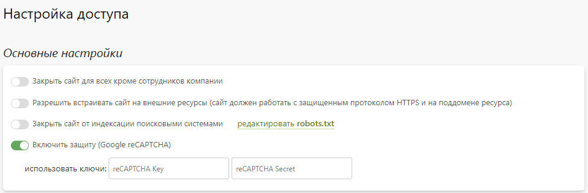
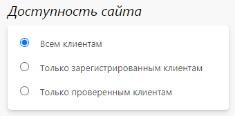
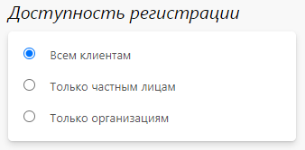
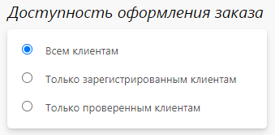
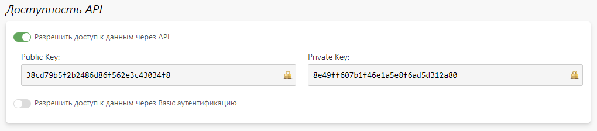
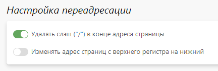
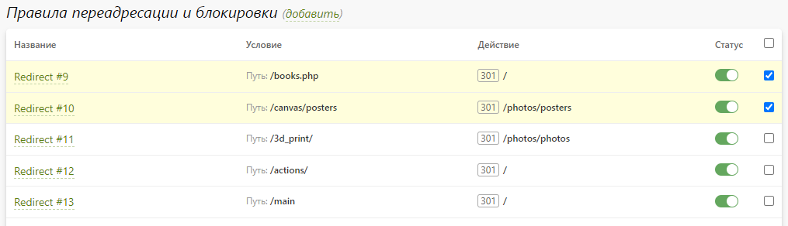
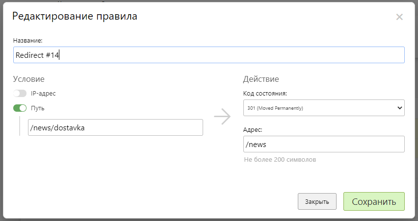
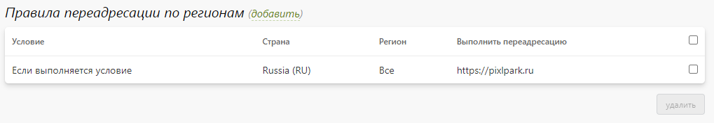
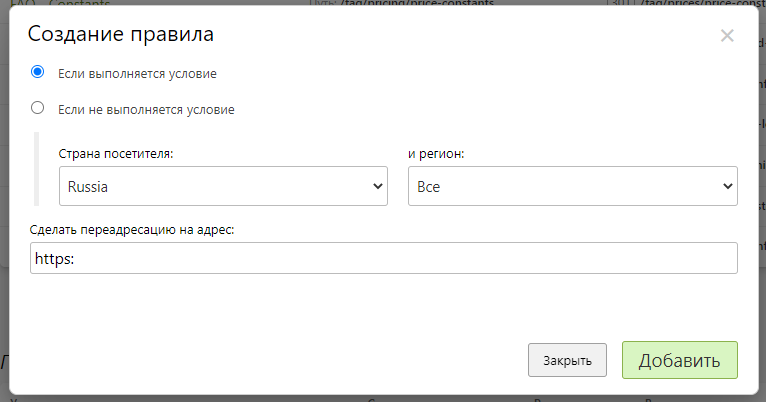

# Настройки доступа

## Основные настройки
* __Закрыть сайт для всех, кроме сотрудников компании__ - при посещении сайта всеми, кроме сотрудников, отображать сообщение о проведении технических работ (т.е. для посетителей сайт функционировать не будет). У сотрудников сайт продолжит работать в обычном режиме.
* __Разрешить встраивать сайт на внешние ресурсы__ - разрешить встраивать редакторы во внешние интернет-магазины с возможностью обмена данными. Подробнее об этом можно прочитать в статье "[Установка онлайн-редактора во внешний интернет-магазин](/dev/editor)".
* __Закрыть сайт от индексации поисковыми системами__ - запретить поисковым системам индексировать сайт. Данный режим необходимо включать в процессе настройки сайта (когда он на боевом домене), чтобы некорректные данные не успели попасть и закэшироваться в поисковой выдаче.
* __Включить защиту (Google reCAPTCHA)__ - выключить или включить проверку от спам-ботов ("я не робот").
> Ключи для Google reCAPTHA можно получить [на странице](https://www.google.com/recaptcha/admin/create).
* 

## Доступность сайта
* __Всем клиентам__ - сайт в полном объеме доступен всем посетителям.
* __Только зарегистрированным клиентам__ - сайт в полном объеме доступен только авторизованным посетителям, для всех остальных доступна только страница регистрации и авторизации.
* __Только проверенным клиентам__ - сайт в полном объеме доступен только авторизованным посетителям со статусом "проверен", для всех остальных доступна только страница регистрации и авторизации.

## Доступность регистрации
* __Всем клиентам__ - регистрация на сайте возможна как частным лицам, так организациям.
* __Только частным лицам__ - регистрация на сайте возможна только частным лицам.
* __Только организациям__ - регистрация на сайте возможна только организациям.

## Доступность оформления заказа
* __Всем клиентам__ - страницы оформления заказа (редактор-корзина-доставка) доступны всем посетителям сайта.
* __Только зарегистрированным клиентам__ - страницы оформления заказа (редактор-корзина-доставка) доступны только зарегистрированным клиентам.
* __Только проверенным клиентам__ - страницы оформления заказа (редактор-корзина-доставка) доступны только зарегистрированным клиентам со статусом "проверен".

## Доступность API
* В данном разделе включается доступ к данным сайта через программный интерфейс по секретным ключам.

> Более подробно о настройке доступа написано в разделе "Разработчикам" в статье "[Работа c API и Вебхуки](/dev/api)".

## Настройка переадресации
* В данном разделе задается логика обработки адресов страниц сайта:
    + Удаление слэша в конце адресной строки.
    + Изменение на нижний регистр адреса страницы.
* 

## Правила переадресации и блокировки
* Очень часто при переносе существующего сайта на платформу Pixlpark у него изменяется структура, что ведет к изменению адресов страниц. Чтобы из-за этого сайт не потерял позиции в поисковой выдаче, необходимо сообщить поисковым роботам об этом изменении через данные правила, настраивая условия по пути (старые адреса страниц) с переадресацией по адресу с кодом 301.  
* Это же поможет посетителям попадать на нужные страницы, даже если они вводили в браузере их старые адреса.
* В данном разделе задаются правила, позволяющие либо блокировать посетителям доступ к сайту, либо автоматически переадресовать их с одних страниц сайта на другие.
* Каждое правило обладает следующими характеристиками:
    + __Название__ - название правила.
    + __Условие__:
        - __IP-адрес__ - полное совпадение с указанным IP-адресом посетителя или попадание его в заданную подсеть.
        - __Путь__ - полное совпадение адреса страницы с заданным путем..
    + __Действие__:
        - __Код состояния (301)__ - переадресовать посетителя по указанному адресу с информированием браузера о том, что запрашиваемая страница теперь будет находится по новому адресу.
        - __Код состояния (302)__ - переадресовать посетителя по указанному адресу с информированием браузера о том, что запрашиваемая страница временно находится по новому адресу.
        - __Код состояния (403)__ - заблокировать посетителю доступ к сайту с отображением сообщения.
        - __Код состояния (404)__ - информировать посетителя о невозможности найти запрашиваемую страницу сайта с отображением сообщения.
* 
* 

## Правила переадресации по регионам
* В данном разделе задаются правила, позволяющие переадресовать посетителей по указанному адресу, если их геолокация совпадает или не совпадает с указанной.
* Каждое правило обладает следующими характеристиками:
    + Условие совпадения или несовпадения геолокации посетителя с заданной страной и/или регионом.
    + Адрес переадресации в случае выполнения условия.
* 
* 

> Данный механизм переадресации будет незаменимым при построении федерального портала, в рамках которого у каждого региона будет свой сайт (работающий либо на папке, либо на поддомене). Соответственно, каждого посетителя нужно будет переадресовывать на региональный сайт (по условию принадлежности его IP-адреса указанной стране и региону).
