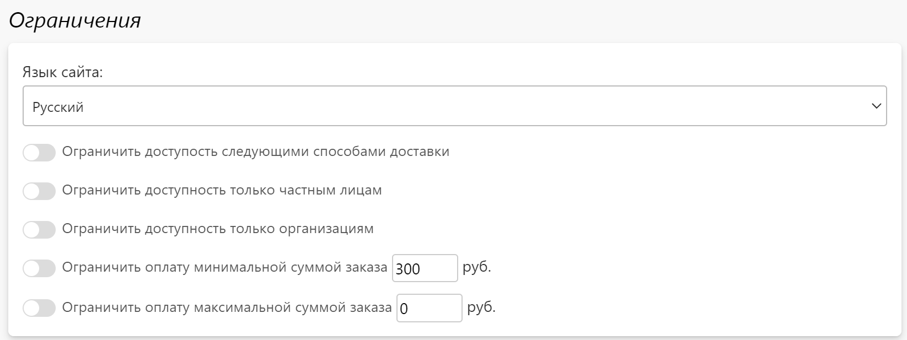

# Оплата
## Способы оплаты
* В сервисе Pixlpark предусмотрено несколько типов оплаты:
    + __Оплата наличными__ - оплата заказа наличными при его получении.
    + __Оплата с личного счета__ - оплата заказа со счета физического лица.
    + __Оплата со счета организации__ - оплата заказа со счета организации.
    + __Оплата банковским переводом__ - оплата заказа по счету (по реквизитам).
    + __Оплата через платежную систему__ - оплата заказа банковской картой или с помощью электронного кошелька через платежную систему.

* В данном разделе представлен список способов оплаты, которые можно отфильтровать по двум критериям:
    + __Доступности__ - где доступны способы оплаты: на сайте, в приложении или нигде.
    + __Типу оплаты__ - одному из перечисленных выше типов.
* 

## Карточка оплаты
* __Содержание__
    + [Основная информация](/site/payments?id=Основная-информация)
    + [Ограничения](/site/payments?id=Ограничения)
    + [Комиссия платежной системы](/site/payments?id=Комиссия-платежной-системы)
    + [Настройка платежной системы](/site/payments?id=Настройка-платежной-системы)
    + [Платежные документы](/site/payments?id=Платежные-документы)
    + [Примечание на сайте](/site/payments?id=Примечание-на-сайте)

### Основная информация
* В данном разделе представлены общие настройки выбранного способа оплаты.

### Ограничения
* В данном разделе представлены настройки, позволяющие:
    + Ограничить доступность способа оплаты наличием в корзине определенных категорий товаров из разделов "__Печать__" / "__Сувениры__" / "__Магазин__". 
    + Ограничить доступность способа оплаты суммой товаров в корзине.
    + Ограничить доступность способа оплаты по способам доставки.
    + Ограничить доступность способа оплаты по типам клиентов.
* 

### Комиссия платежной системы
!> Данный блок предусмотрен только для оплаты с типом "__оплата наличными__" и "__оплата через платежную систему__".
* Комиссия при оплате наличными компенсирует затраты на изготовление заказов, которые не забрали клиенты
* В случае оплаты через платежную систему можно задать, кто будет оплачивать комиссию - либо компания, включив размер комиссии в стоимость заказа, либо клиент.

### Настройки платежной системы
* В данном разделе представлены настройки, отражающие специфику каждого типа оплаты:
    + Для оплаты наличными можно задать обязательность онлайн предоплаты, ее размер и ограничение по категориям раздела "__Печать__".
    + Для оплаты с личного счета или со счета организации можно разрешить пополнение счета в личном кабинете, задать минимальную и максимальную сумму, а также максимальную долю в платеже за заказ.
    + Для оплаты через платежную систему можно задать параметры для интеграции с выбранной системой.
* 

### Платежные документы
!> Данный раздел предусмотрен только для оплаты с типом "__оплата банковским переводом__".

* __Содержание__
    + [Список документов](/site/payments?id=Список-платежных-документов)
    + [Карточка документа](/site/payments?id=Карточка-платежного-документа)

#### Список платежных документов
* В данном разделе отображается список документов, которые клиент может скачать на сайте для оплаты заказа. Например, это могут быть счета для организаций с различными системами налогообложения.
* Также в этом блоке можно:
    + Перейти в карточку документа.
    + Добавить новый документ.
    + Включить или выключить любой документ.
    + Удалить выделенные документы.
* 

#### Карточка платежного документа
* В карточке документа есть три блока:
    + __Основная информация__ - задаются общие настройки документа.
    
    + __Ограничения__ - задается настройки, отвечающие за доступность документа в зависимости от языка сайта, типа клиента, выбранного способа доставки и суммы заказа.
    
    + __Документ__ - задается разметка документа в формате HTML.
    

### Примечание на сайте
* В данном разделе можно задать примечание в виде HTML-разметки, которое будет выводиться на странице выбора способа оплаты.

## Реквизиты
* __Содержание__
    + [Список реквизитов](/site/payments?id=Список-реквизитов)
    + [Карточка реквизита](/site/payments?id=Карточка-реквизита)

### Список реквизитов
* В данном разделе представлены банковские реквизиты компании, которые используются в карточке заказа в блоке "Информация об оплате" при внесении оплаты банковским переводом. Это позволяет компании отслеживать, на какой расчетный счет поступила оплата.
* Также на странице списка можно:
    + Перейти в карточку адреса.
    + Принудительно провести синхронизацию адресов.
    + Добавить новый адрес пункта выдачи вручную.
* 

### Карточка реквизита
* В данном разделе задаются банковские реквизиты компании.

## Фискализация
* __Содержание__
    + [Основная информация](/site/payments?id=Основная-информация-1)
    + [Сервисы фискализации](/site/payments?id=Сервисы-фискализации)

### Основная информация
* В данном разделе представлены общие настройки фискализации:
    + Включение отправки электронных чеков.
    + Ставка НДС для электронных чеков.
    + Передача количества товаров в названии позиции.
    + Система налогообложения компании.
* 

### Сервисы фискализации
* В данном разделе можно настроить один из интегрированных сервисов фискализации:
    + [Бухсофт онлайн-касса](https://www.buhsoft.ru/news/695-buhsoft-onlayn-kassa-servis-pechati-kassovyh-chekov)
    + [АТОЛ онлайн](https://online.atol.ru/)
    + [Checkbox](https://checkbox.ua/)
* 