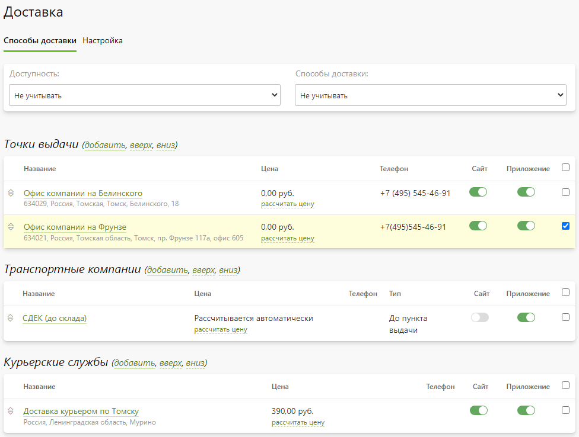
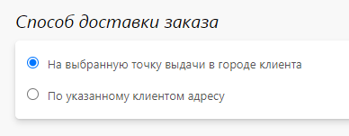

# Способы доставки

## Список доставок
* В данном разделе представлены все способы доставки, которые группируются на три блока по своему типу:
    + __Точка выдачи__ - самостоятельное получение заказа клиентом из собственного офиса компании или партнерской точки выдачи.
    + __Транспортная компания__ - доставка заказа либо по указанному адресу, либо в пункт выдачи транспортной компании в городе клиента.
    + __Курьерская служба__ - доставка заказа по указанному адресу внутренней или внешней курьерской службой в рамках текущего региона.

* Также на странице можно:
    + Отфильтровать доставки по их доступности.
    + Перейти в карточку доставки.
    + Добавить новую доставку.
    + Рассчитать стоимость доставки заказа с указанным весом.
    + Включить или выключить любую доставку как для сайта, так и для мобильного приложения.
    + Дублировать выделенные доставки.
    + Изменить порядок следования доставок одного типа внутри блока.
    + Изменить порядок следования блоков с типами доставок.
    + Удалить выделенные доставки.
* 

## Точка выдачи
* __Содержание__
    + [Основная информация](/site/shippings?id=Основная-информация)
    + [Ограничения](/site/shippings?id=Ограничения)
    + [Время работы](/site/shippings?id=Время-работы)
    + [Стоимость доставки](/site/shippings?id=Стоимость-доставки)
    + [Связь с опциями](/site/shippings?id=Связь-с-опциями)

### Основная информация
* В данном разделе представлены базовые настройки точки выдачи.

### Ограничения
* В данном разделе представлены настройки, позволяющие:
    + Ограничить доступность способа доставки наличием в корзине определенных категорий товаров из разделов "Печать" / "Сувениры" / "Магазин". 
    + Ограничить доступность способа доставки суммой позиций в корзине.
    + Ограничить применение способов оплаты для данного способа доставки.
* 

### Полный адрес
* В данном разделе задается полный адрес местонахождения точки выдачи, включая широту и долготу (для корректного позиционирования на карте).

### Время работы
* Данный раздел отображается только при включении функции "[Время исполнения заказов](/orders/settings?id=Время-исполнения-заказов)" (раздел "__Заказы / Настройка / Управление заказами__"). В нем задается время работы точки выдачи, которое используется в автоматическом расчете времени готовности заказа.

### Стоимость доставки
* В данном разделе задается алгоритм расчета стоимости доставки в зависимости от веса заказа.

### Связь с опциями
* В данномразделе отображается список опций, их позиции и продукты, с которыми они связаны. Список опций можно фильтровать по группам печати.
* Каждую позиции опции можно сделать доступной, либо недоступной для данного способа доставки.
* Представленный механизм позволяет очень быстро отключать определенные позиции опций для доставки, если, например, выходит из строя оборудование на точке выдачи, позволяющее на месте выполнять какие-то операции, отраженные в позиции опций.

## Транспортная компания

### Способ доставки заказа
* Данный блок предусмотрен только для доставки с типом "транспортная компания". 
* В нем задается способ доставки заказа:
    + На выбранный пункт выдачи в городе клиента.
    + По указанному клиентом адресу.

### Настройка интеграции с ТК
* Данный блок предусмотрен только для доставки с типом "транспортная компания". 
* В нем:
    1. Выбирается интегрированная в сервис транспортная компания (ТК).
    2. Задаются специфичные настройки ТК.
    3. Определяется алгоритм расчета стоимости доставки ТК.

### Адреса доставки ТК
* Данный блок предусмотрен только для доставки с типом "транспортная компания". 

#### Список адресов
* В данном разделе отображается список адресов пунктов выдачи ТК. При синхронизации раз в сутки полностью обновляется список и информация о каждом пункте выдачи.
* Также на странице списка можно:
    + Перейти в карточку адреса.
    + Принудительно провести синхронизацию адресов.
    + Добавить новый адрес пункта выдачи вручную.
    + Отфильтровать список в соответствии с поисковой строкой.
    + Включить или выключить любой адрес (пункт выдачи).
    + Задать стоимость доставки для выделенных адресов.
    + Удалить выделенные адреса.
    + Установить порядок следования адресов на сайте.

#### Карточка адреса
* В карточке товара есть три блока:
    + __Основная информация__ - задаются базовые настройки адреса доставки.
    + __Полный адрес__ - задается полный адрес местонахождения точки выдачи, включая широту и долготу (для корректного позиционирования на карте).
    + __Стоимость доставки__ - задается алгоритм расчета стоимости доставки в зависимости от веса заказа.
* 

### Отслеживание отправлений
* Данный блок предусмотрен только для доставки с типом "транспортная компания". 
* В нем задаются настройки для отслеживания клиентом из личного кабинета отправлений транспортной компанией. В зависимости от ТК возможно отслеживание как через GET, так и через POST-запрос.

## Курьерская служба

## Настройка
* В данном разделе представлены три блока:
    + __Основная информация__ - задаются базовые настройки страницы доставки.
    + __Точки выдачи__ - задаются настройки, отвечающие за изменения списка точек выдачи.
    + __Курьерские службы__ - задаются настройки, отвечающие за изменения списка курьерских служб.
* 