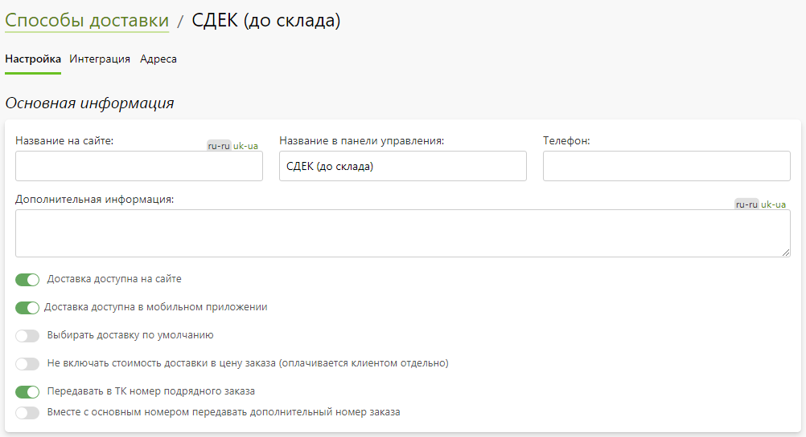
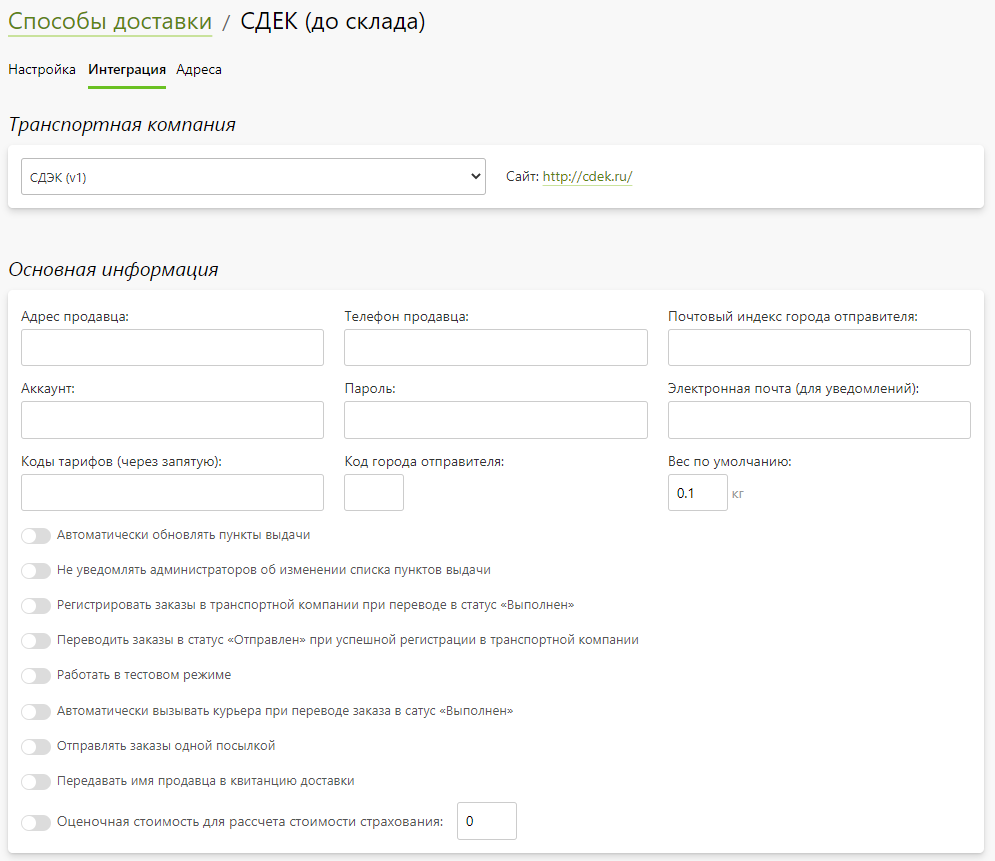
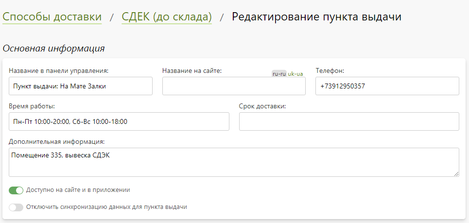
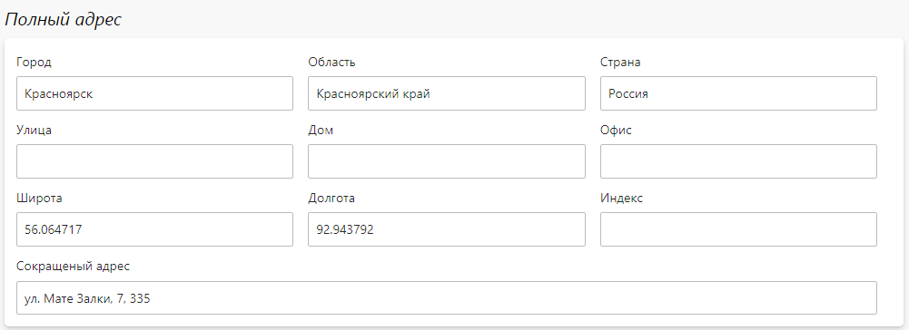
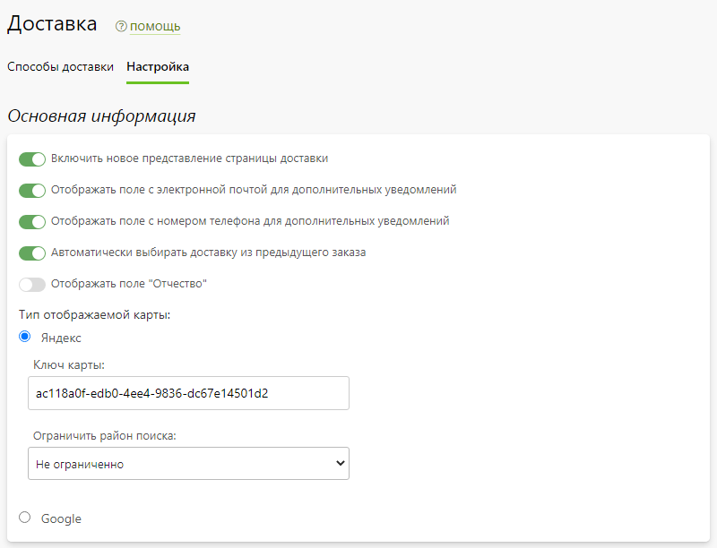

# Доставка

## Способы доставки
* В данном разделе представлены все способы доставки, которые группируются на три блока по своему типу:
    + __Точка выдачи__ - самостоятельное получение заказа клиентом из собственного офиса компании или партнерской точки выдачи.
    + __Транспортная компания__ - доставка заказа либо по указанному адресу, либо в пункт выдачи транспортной компании в городе клиента.
    + __Курьерская служба__ - доставка заказа по указанному адресу внутренней или внешней курьерской службой в рамках текущего региона.

* Также на странице можно:
    + Отфильтровать доставки по их доступности.
    + Перейти в карточку доставки.
    + Добавить новую доставку.
    + Рассчитать стоимость доставки заказа с указанным весом.
    + Включить или выключить любую доставку как для сайта, так и для мобильного приложения.
    + Дублировать выделенные доставки.
    + Изменить порядок следования доставок одного типа внутри блока.
    + Изменить порядок следования блоков с типами доставок.
    + Удалить выделенные доставки.
* 

## Точка выдачи
* __Содержание__
    + [Основная информация](/site/shippings?id=Основная-информация)
    + [Ограничения](/site/shippings?id=Ограничения)
    + [Время работы](/site/shippings?id=Время-работы)
    + [Стоимость доставки](/site/shippings?id=Стоимость-доставки)
    + [Связь с опциями](/site/shippings?id=Связь-с-опциями)

### Основная информация
* В данном разделе представлены базовые настройки способа доставки с типом "точка выдачи".

### Ограничения
* В данном разделе представлены настройки, позволяющие:
    + Ограничить доступность способа доставки наличием в корзине определенных категорий товаров из разделов "Печать" / "Сувениры" / "Магазин". 
    + Ограничить доступность способа доставки суммой позиций в корзине.
    + Ограничить применение способов оплаты для данного способа доставки.
* 

### Полный адрес
* В данном разделе задается полный адрес местонахождения точки выдачи, включая широту и долготу (для корректного позиционирования на карте).

### Время работы
* Данный раздел отображается только при включении функции "[Время исполнения заказов](/orders/settings?id=Время-исполнения-заказов)" (раздел "__Заказы / Настройка / Управление заказами__"). В нем задается время работы точки выдачи, которое используется в автоматическом расчете времени готовности заказа.

### Стоимость доставки
* В данном разделе задается алгоритм расчета стоимости доставки в зависимости от веса заказа.

### Связь с опциями
* В данномразделе отображается список опций, их позиции и продукты, с которыми они связаны. Список опций можно фильтровать по группам печати.
* Каждую позиции опции можно сделать доступной, либо недоступной для данного способа доставки.
* Представленный механизм позволяет очень быстро отключать определенные позиции опций для доставки, если, например, выходит из строя оборудование на точке выдачи, позволяющее на месте выполнять какие-то операции, отраженные в позиции опций.

## Курьерская служба
* __Содержание__
    + [Основная информация](/site/shippings?id=Основная-информация-1)
    + [Ограничения](/site/shippings?id=Ограничения-1)
    + [Зоны доставки](/site/shippings?id=Зоны-доставки)

### Основная информация
* В данном разделе представлены базовые настройки способа доставки с типом "курьерская служба".

### Ограничения
* В данном разделе представлены настройки, позволяющие:
    + Ограничить доступность способа доставки наличием в корзине определенных категорий товаров из разделов "Печать" / "Сувениры" / "Магазин". 
    + Ограничить доступность способа доставки суммой позиций в корзине.
    + Ограничить применение способов оплаты для данного способа доставки.
* 

### Зоны доставки
* __Содержание__
    + [Список зон](/site/shippings?id=Список-зон-доставки)
    + [Карточка зоны](/site/shippings?id=Карточка-зоны-доставки)

#### Список зон доставки
* В данном разделе отображается список зон, куда может быть осуществлена доставка. Например, это может быть: город, пригород, область.

#### Карточка зоны доставки
* В данном разделе настраивается зона доставки.

## Транспортная компания
* __Содержание__
    + [Основная информация](/site/shippings?id=Основная-информация-2)
    + [Ограничения](/site/shippings?id=Ограничения-2)
    + [Отслеживание отправлений](/site/shippings?id=Отслеживание-отправлений)
    + [Настройка интеграции с ТК](/site/shippings?id=Настройка-интеграции-с-ТК)
    + [Стоимость доставки](/site/shippings?id=Стоимость-доставки-1)
    + [Размер отправлений](/site/shippings?id=Размер-отправлений)
    + [Способ доставки](/site/shippings?id=Способ-доставки)
    + [Пункты выдачи](/site/shippings?id=Пункты-выдачи)

### Основная информация
* В данном разделе представлены базовые настройки способа доставки с типом "транспортная компания".

### Ограничения
* В данном разделе представлены настройки, позволяющие:
    + Ограничить доступность способа доставки наличием в корзине определенных категорий товаров из разделов "Печать" / "Сувениры" / "Магазин". 
    + Ограничить доступность способа доставки суммой позиций в корзине.
    + Ограничить применение способов оплаты для данного способа доставки.
* 

### Отслеживание отправлений
* В данном разделе задаются настройки для отслеживания клиентом из личного кабинета отправлений транспортной компанией. В зависимости от ТК возможно отслеживание как через GET, так и через POST-запрос.

### Настройка интеграции с ТК
* В данном разделе выбирается интегрированная транспортная компания для текущего способа доставки и задаются ее специфичные настройки.

### Стоимость доставки
* В данном разделе задается алгоритм расчета стоимости доставки.

### Размер отпрвлений
* В данном разделе задаются габариты отправлений, которые затем передаются в транспортную компанию при регистрации заказа.

### Способ доставки
* В данном разделе задается способ доставки заказа для текущего способа доставки. Большинство транспортных компаний могут работать в двух режимах доставки, для каждого из которых в Pixlpark нужно создавать отдельную доставку:
    + На выбранный пункт выдачи в городе клиента.
    + По указанному клиентом адресу.
* 

### Пункты выдачи
* __Содержание__
    + [Список пунктов выдачи](/site/shippings?id=Список-пунктов-выдачи)
    + [Карточка пункта выдачи](/site/shippings?id=Карточка-пункта-выдачи)

#### Список пунктов выдачи
* В данном разделе отображается список пунктов выдачи транспортной компании. В зависимости от настроек доставки список и информация о каждом пункте выдачи могут синхронизироваться раз в сутки.

* Также на странице списка можно:
    + Перейти в карточку пункта выдачи.
    + Принудительно провести синхронизацию пунктов выдачи.
    + Добавить новый пункта выдачи вручную.
    + Отфильтровать список в соответствии с поисковой строкой.
    + Включить или выключить любой пункт выдачи.
    + Задать стоимость доставки для выделенных пунктов выдачи.
    + Удалить выделенные пункты выдачи.
    + Установить порядок следования пунктов выдачи.
* 

#### Карточка пункта выдачи
* В карточке пункта выдачи есть три блока:
    + __Основная информация__ - задаются базовые настройки адреса доставки.
    
    + __Полный адрес__ - задается полный адрес местонахождения точки выдачи, включая широту и долготу (для корректного позиционирования на карте).
    
    + __Стоимость доставки__ - задается алгоритм расчета стоимости доставки в зависимости от веса заказа.
    

## Настройка
* __Содержание__
    + [Основная информация](/site/shippings)
    + [Точки выдачи](/site/shippings)
    + [Курьерские службы](/site/shippings)

### Основная информация
* В данном разделе задается базовые настройки страницы доставки.
* 

### Точки выдачи
* В данном разделе задаются настройки, отвечающие за изменения списка точек выдачи.
* 

### Курьерские службы
* В данном разделе задаются настройки, отвечающие за изменения списка курьерских служб.
* 